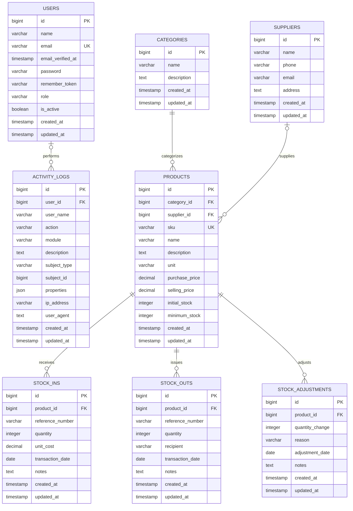

# Entity Relationship Diagram (ERD) — StockWise

ERD ini menggambarkan struktur tabel utama dan hubungan antarentitas pada aplikasi manajemen stok StockWise.

```mermaid
erDiagram
    USERS o|--o{ ACTIVITY_LOGS : performs
    CATEGORIES ||--o{ PRODUCTS : categorizes
    SUPPLIERS o|--o{ PRODUCTS : supplies
    PRODUCTS ||--o{ STOCK_INS : receives
    PRODUCTS ||--o{ STOCK_OUTS : issues
    PRODUCTS ||--o{ STOCK_ADJUSTMENTS : adjusts

    USERS {
        bigint id PK
        varchar name
        varchar email UK
        timestamp email_verified_at
        varchar password
        varchar remember_token
        varchar role
        boolean is_active
        timestamp created_at
        timestamp updated_at
    }

    ACTIVITY_LOGS {
        bigint id PK
        bigint user_id FK
        varchar user_name
        varchar action
        varchar module
        text description
        varchar subject_type
        bigint subject_id
        json properties
        varchar ip_address
        text user_agent
        timestamp created_at
        timestamp updated_at
    }

    CATEGORIES {
        bigint id PK
        varchar name
        text description
        timestamp created_at
        timestamp updated_at
    }

    SUPPLIERS {
        bigint id PK
        varchar name
        varchar phone
        varchar email
        text address
        timestamp created_at
        timestamp updated_at
    }

    PRODUCTS {
        bigint id PK
        bigint category_id FK
        bigint supplier_id FK
        varchar sku UK
        varchar name
        text description
        varchar unit
        decimal purchase_price
        decimal selling_price
        integer initial_stock
        integer minimum_stock
        timestamp created_at
        timestamp updated_at
    }

    STOCK_INS {
        bigint id PK
        bigint product_id FK
        varchar reference_number
        integer quantity
        decimal unit_cost
        date transaction_date
        text notes
        timestamp created_at
        timestamp updated_at
    }

    STOCK_OUTS {
        bigint id PK
        bigint product_id FK
        varchar reference_number
        integer quantity
        varchar recipient
        date transaction_date
        text notes
        timestamp created_at
        timestamp updated_at
    }

    STOCK_ADJUSTMENTS {
        bigint id PK
        bigint product_id FK
        integer quantity_change
        varchar reason
        date adjustment_date
        text notes
        timestamp created_at
        timestamp updated_at
    }
```
